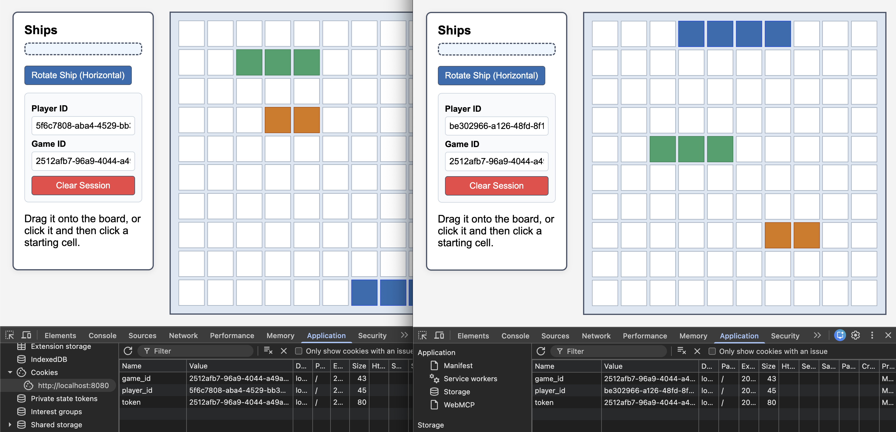
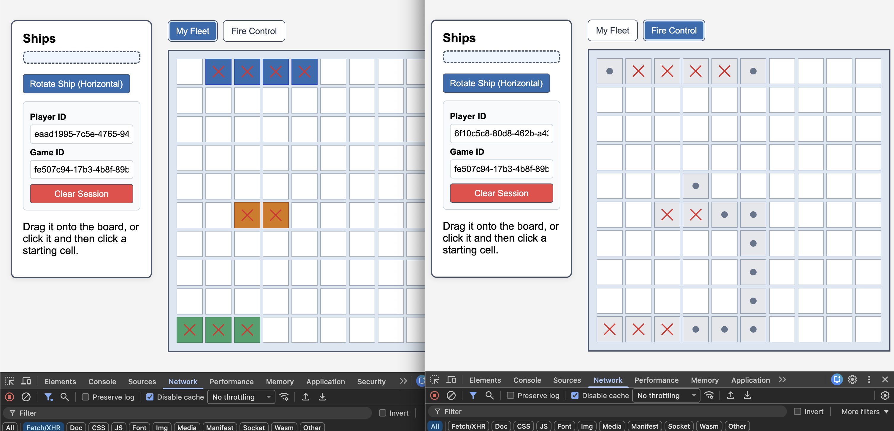

== Work in progress == 

# Battleship
Implementation of Battle Ship Game in Go & Javascript.

### Goal

The goal of this project is to create a scalable testbed for experimenting with concurrency models and optimizing network performance under heavy load.

### Basic Logic

// Player 1 loads page 
    // fires join API
    // BE creates Game and push to redis with Player 1 information
    // Gets token and game id

// Now game is available for second player to join

// Player 1 gets ships

// Player 1 places a ship
    // Fires placement API
    // Finishes placement (after 3) 
    // Game is now ready to begin (from player 1 perspective)

// Player 2 loads page
    // fires join API
        // BE searches for active games in ready for join
            // push to redis with Player 2 information into Game object
            // return the game id and token.

