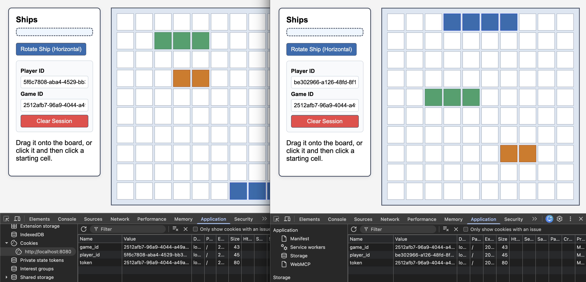
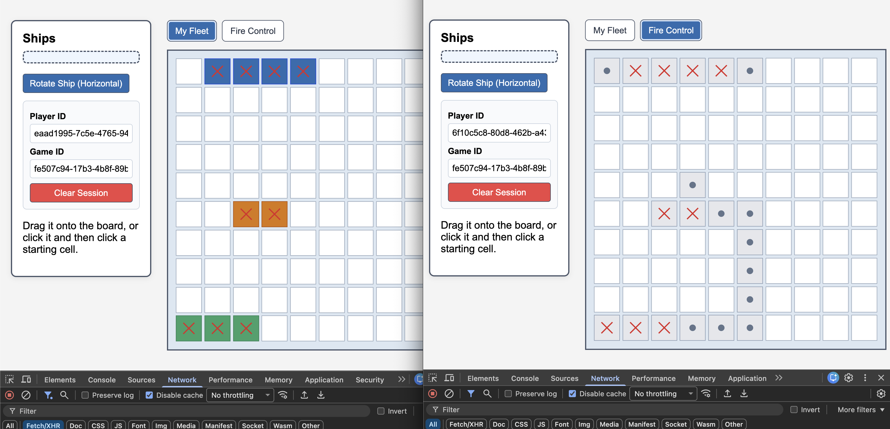

# Battleship

A browser-based Battleship game implemented with Go on the backend and vanilla JavaScript on the frontend.

## Overview

This repository contains a multiplayer Battleship prototype where two players can join the same game, place fleets on a 10x10 board, and fire at each other using a real-time EventSource stream.

The app is designed as a lightweight testbed for game state handling, server-sent events, and simple HTTP API coordination.

## Features

- Multiplayer game session management
- Ship placement using drag & drop or click-to-place controls
- Turn-based firing with hit / miss recording
- Server-sent events (SSE) for live game updates
- In-memory game state stored in backend `GameStore`
- Single binary Go server with bundled static UI

## Architecture

- `cmd/server/main.go` - main server entrypoint
- `cmd/server/ui/static/` - frontend assets: CSS, JS, images
- `cmd/server/ui/static/templates/index.html` - main HTML UI
- `internal/handlers/` - game logic and HTTP route handlers

The backend uses Go's `net/http` package and exposes several JSON-based APIs. The client communicates via REST requests and listens for SSE messages for opponent activity and board updates.

## Running locally

Requirements:

- Go 1.26+

Steps:

1. Open a terminal in the project folder.
2. Run:

```sh
go run ./cmd/server
```

3. Open a browser at:

```sh
http://localhost:8080
```

4. Open the same URL in a second browser or a separate window to join as a second player.

## Game flow

1. Load the page. The client calls `/api/join` to create or join a game.
2. The server returns `game_id`, `player_id`, and a session `token`.
3. Each player places three ships on their fleet board.
4. Once both players place all ships, the game becomes ready.
5. Players switch to the firing board and take turns submitting shots to `/api/fire`.
6. The backend broadcasts board updates and game state changes via `/api/events/{token}`.

## HTTP API

- `POST /api/join`
  - Creates a new game or joins an available waiting game.
  - Uses token header for reconnecting to an existing session.

- `POST /api/placement`
  - Submits a ship placement for the current player.
  - Request body includes ship type and position coordinates.

- `GET /api/playerInfo`
  - Retrieves the player's current board state, including ships and misses.

- `POST /api/fire`
  - Fires at a coordinate on the opponent's board.
  - Returns `true` or `false` depending on whether the shot hit.

- `GET /api/events/{token}`
  - Opens an SSE stream for live updates.
  - Emits events such as `player-joined`, `game-ready`, `update`, and `game-over`.

## Notes

- Game state is currently stored in memory in `GameStore` and is not persisted across server restarts.
- The frontend stores the session `token`, `game_id`, and `player_id` in browser cookies.
- No authentication is implemented beyond the session token mechanism.

## Future improvements

- Persist games in Redis or another datastore
- Add proper turn enforcement on the backend
- Improve ship placement validation and overlap detection
- Add player lobby / reconnect support
- Add a win screen and replay flow

## Screenshots



